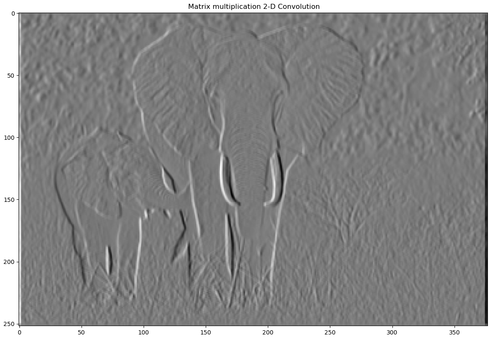

# Convolution as Matrix Multiplication

Perfomred convolution on an elephant image as a matrix multiplication using a vertical edge filter matrix.

The vertical edge filter matrix-

| 1 | 0 | -1 |
| ------------- | ------------- | ------------- | 
| **1** | **0** | **-1** |
| **1** | **0** | **-1** |

The original elephant image is-

The edge filtered image after 2d convolution is-

